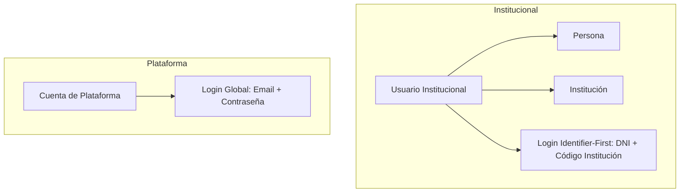

# AUTENTICACIÓN Y AUTORIZACIÓN

Este documento describe el modelo de seguridad, los mecanismos de autenticación dual, el ciclo de vida de tokens y la gestión de permisos dinámicos en Boero.

## 1. Visión General de Seguridad

Boero implementa una arquitectura de seguridad diseñada para entornos educativos multitenant:

- **Autenticación Dual**: Separa completamente las cuentas institucionales de las cuentas administrativas globales de la plataforma.
- **Protocolo Stateless con Control de Sesión**: Los endpoints se autentican mediante JSON Web Tokens (JWT) sin estado HTTP, pero el sistema mantiene el control de sesiones activas en base de datos (`UserSession`) y revocación en Redis.
- **Rotación Estricta de Refresh Tokens**: Previene la persistencia de tokens de larga duración e incorpora detección automática de reutilización (replay attack).
- **Autorización Dinámica por Permisos**: Los permisos se evalúan dinámicamente y pueden acotarse a nivel institucional o a trayectos formativos específicos.

## 2. Modelo Dual de Autenticación

El sistema distingue dos tipos de identidades independientes:

### A. Usuarios Institucionales (`User`)
- **Público**: Estudiantes, docentes, directivos y personal administrativo.
- **Credenciales**: Documento de identidad + Código de la institución + Contraseña (o Passkey).
- **Flujo de Acceso**:
  1. `POST /api/v1/auth/login/identify`: Valida la existencia del usuario en la institución y emite un `loginAttemptId` efímero.
  2. `POST /api/v1/auth/login/password` o WebAuthn: Valida la credencial contra el intento activo, genera la sesión y emite los tokens.

### B. Cuentas de Plataforma (`PlatformAccount`)
- **Público**: Administradores y operadores globales del sistema Boero.
- **Credenciales**: Correo electrónico + Contraseña.
- **Flujo de Acceso**:
  - `POST /api/v1/platform/auth/login`: Autenticación directa por email y contraseña. No pertenecen a ninguna institución escolar específica.

## 3. Tokens, Sesiones y Revocación

### Access Token (JWT)
- **Duración**: Corta vida útil (ejemplo: 15 minutos).
- **Firma**: HMAC-SHA256 con clave simétrica secreta de al menos 32 bytes (`JWT_SECRET`).
- **Contenido del payload**:
  - `sub`: Identificador del usuario o cuenta.
  - `jti`: UUID único del token (utilizado para revocación).
  - `sessionId`: ID de la sesión activa (`UserSession`).
  - `institutionId`: Presente únicamente en usuarios institucionales.
- **Validación en cada petición**: `JwtAuthenticationFilter` verifica la firma, comprueba que la sesión no haya finalizado y valida que el `jti` no figure en la blacklist de Redis.

### Refresh Token con Detección de Replay
- **Seguridad en base de datos**: Los tokens de refresco **nunca se almacenan en texto plano**. Se persiste únicamente su hash SHA-256 en Base64.
- **Familias de Rotación**: Cada sesión tiene un `familyId`. Al refrescar (`POST /api/v1/auth/refresh`), el refresh token actual se invalida y se genera uno nuevo dentro de la misma familia.
- **Detección de Replay**: Si se presenta un refresh token que ya fue revocado previamente, el sistema detecta un posible robo de credenciales y **revoca automáticamente toda la familia de tokens y finaliza la sesión activa**.

### Cierre de Sesión (Logout)
- `POST /api/v1/auth/logout`:
  1. Marca la `UserSession` como terminada (`endedAt = NOW()`).
  2. Revoca los refresh tokens de la sesión.
  3. Agrega el identificador `jti` del access token a una blacklist en Redis con un TTL igual al tiempo restante de expiración del token.

## 4. Passkeys y WebAuthn

Boero soporta autenticación FIDO2 / WebAuthn como alternativa moderna y resistente al phishing:
- Registro de múltiples llaves de seguridad o datos biométricos por cuenta (`WEBAUTHN_MAX_PASSKEYS`).
- Desafíos criptográficos unívocos con tiempo de expiración acotado (`WEBAUTHN_CHALLENGE_TTL`).
- Validación de contadores de uso de credenciales para detectar clonación de hardware.

## 5. Autorización y Permisos

- **Sin permisos en el JWT**: Los permisos no viajan dentro del token JWT ni se queman en las autoridades estáticas de Spring Security.
- **Caché y Resolución Dinámica**: Los permisos se resuelven en el backend y se almacenan temporalmente en caché para no degradar la base de datos.
- **Anotaciones Declarativas**: Los controladores protegen sus operaciones mediante `@RequirePermission(Permission.NOMBRE_PERMISO)`.
- **Alcance Acotado por Trayecto (`accessScope`)**:
  - Los roles pueden asignarse a nivel `INSTITUTION` (alcance completo) o `TRAINING_PATHS` (acotado a uno o más trayectos formativos específicos).
  - Un usuario con rol acotado sólo puede operar sobre cursos, cursadas y solicitudes correspondientes a sus trayectos asignados.

## 6. Documentación Técnica Detallada

Para consultar la especificación detallada de cada componente, referirse al índice técnico de autenticación:

👉 **[`docs/auth/INDICE.md`](auth/INDICE.md)**

1. [Modelo de Autenticación](auth/MODELO-DE-AUTENTICACION.md): Entidades y arquitectura de usuarios.
2. [Login y JWT](auth/LOGIN-Y-JWT.md): Flujos detallados de login y composición del JWT.
3. [Refresh Token y Logout](auth/REFRESH-Y-LOGOUT.md): Algoritmo de rotación, replay y blacklist en Redis.
4. [Autorización y Permisos](auth/AUTORIZACION-Y-PERMISOS.md): Aspectos, resolución dinámica y control de acceso.
5. [Casos Particulares](auth/CASOS-PARTICULARES.md): Decisiones de diseño y escenarios de borde.
6. [Estado de Seguridad, Aislamiento y Concurrencia](auth/ESTADO-DE-SEGURIDAD.md): Garantías formales y auditoría.
