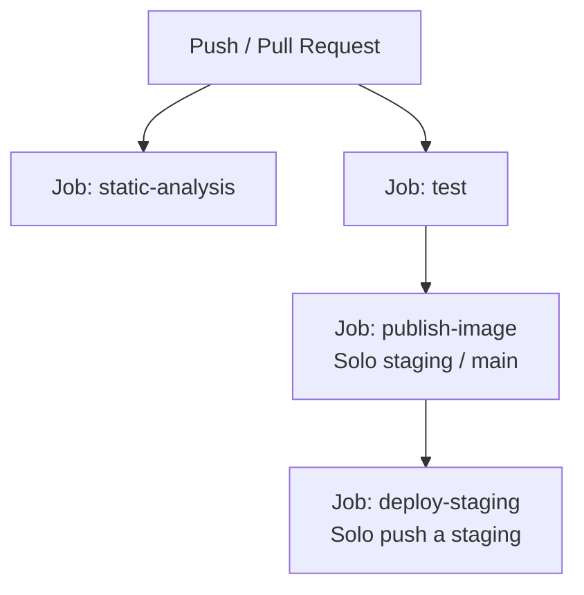

# INTEGRACIÓN CONTINUA Y CALIDAD (CI)

Este documento detalla el flujo de integración continua, las puertas de calidad automatizadas, el análisis estático y el empaquetado de artefactos del backend de Boero.

## 1. Visión General del Pipeline

El pipeline de CI está implementado mediante GitHub Actions en [`.github/workflows/ci.yaml`](../.github/workflows/ci.yaml) y se activa ante:

- **Pull Requests** hacia las ramas `develop`, `staging` y `main`.
- **Pushes** directos a `develop`, `staging` y `main`.

El pipeline incluye control de concurrencia (`cancel-in-progress: true`), lo que cancela automáticamente ejecuciones previas de una misma rama ante nuevos commits para ahorrar recursos.

## 2. Trabajos y Fases del Pipeline

El flujo de trabajo se divide en cuatro trabajos principales:



### A. Trabajo: Análisis Estático (`static-analysis`)

Este trabajo valida la calidad del código, contratos de nulidad y detección temprana de defectos sin necesidad de levantar contenedores Docker ni bases de datos.

- **Comando**:
  ```bash
  ./gradlew --no-daemon --continue staticAnalysis
  ```
- **Toolchains de compilación**:
  - Requiere JDK 21 (compilación normal) y JDK 25 (analizador).
  - Ambos JDK se configuran automáticamente en CI mediante `actions/setup-java`.
- **Herramientas de análisis**:
  1. **NullAway (modo JSpecify estricto)**:
     - Ejecutado con `--release 21` para no alterar la versión del runtime.
     - Inspecciona el 100% de las clases de producción y pruebas (`@NullMarked`).
     - Rechaza cualquier asignación o desreferenciación potencialmente nula que no esté explícitamente declarada con `@Nullable`.
  2. **Eclipse Compiler for Java (ECJ)**:
     - Configurado en `config/static-analysis/ecj.properties`.
     - Trata cualquier advertencia como error bloqueante: imports o miembros no utilizados, conversiones inseguras (raw types), deprecaciones y fugas de recursos cerrables.
- **Artefactos**: En caso de fallo o advertencia, los informes XML de diagnóstico (`build/reports/static-analysis/`) se suben como artefactos de GitHub Actions para su inspección.

### B. Trabajo: Pruebas Automatizadas (`test`)

Garantiza que el comportamiento del sistema y los contratos HTTP e institucionales no se rompan.

- **Flujo en rama `develop` (desarrollo activo)**:
  1. **Formato**: `./gradlew spotlessCheck` (Google Java Format).
  2. **Pruebas Rápidas**: `./gradlew fastTest` (tests unitarios y slices aislados con mocks).
  3. **Detección Inteligente de Persistencia**: Un script de bash analiza el diff contra la rama base:
     - Si se modifican archivos en `src/main/resources/db/migration/`, entidades, repositorios, controladores, configuración o `build.gradle`, CI ejecuta automáticamente:
       ```bash
       ./gradlew --no-daemon integrationTest
       ```
     - Si los cambios no afectan persistencia (por ejemplo, documentación o tests unitarios aislados), se omite la ejecución pesada de Testcontainers para acelerar el feedback del PR.
- **Flujo en ramas `staging` y `main` (integración y publicación)**:
  - Ejecuta la suite completa sin omisiones:
    ```bash
    ./gradlew --no-daemon spotlessCheck test
    ```

#### Fixtures y contratos de error

- Las entidades creadas con fábricas de dominio no reciben un UUID hasta su persistencia. En tests unitarios que simulan entidades persistidas, usar un `spy` con `doReturn(id).when(entity).getId()` cuando el caso de uso consulta ese identificador; mantener los argumentos exactos de los mocks y la validación estricta de Mockito.
- La validación de logos distingue archivos que superan los 2 MiB (`InstitutionLogoTooLargeException`) de contenido inválido, vacío, truncado o con dimensiones excesivas (`InvalidInstitutionLogoException`). Verificar estos contratos por separado.

### C. Trabajo: Construcción y Publicación de Imágenes (`publish-image`)

Se ejecuta únicamente tras aprobar el trabajo de pruebas en pushes a `staging` o `main`.

- **Imagen Docker multi-stage**:
  - Utiliza el target `prod` de [`Dockerfile`](../Dockerfile).
  - Compila con Gradle Wrapper y extrae las capas de Spring Boot (`bootJar -Djarmode=tools extract`) para optimizar el almacenamiento en caché de Docker y acelerar despliegues posteriores.
  - El contenedor de producción corre sobre un runtime mínimo con un usuario sin privilegios (`appuser`).
- **Registro de Contenedores**:
  - Las imágenes se publican en GitHub Container Registry (`ghcr.io/typeitorg/boero-api`).
  - Se publican dos tags por imagen:
    1. Inmutable por commit: `ghcr.io/typeitorg/boero-api:sha-<commit_sha>`.
    2. Móvil por rama: `ghcr.io/typeitorg/boero-api:staging` o `:main`.

### D. Trabajo: Despliegue Continuo a Staging (`deploy-staging`)

- Se activa tras la publicación de la imagen en pushes a `staging`.
- Conecta por SSH mediante clave privada a la VPS configurada en `boero-infra`.
- Actualiza el contenedor del API pasando la versión inmutable:
  ```bash
  make deploy-api ENV=staging VERSION=sha-<commit_sha>
  ```
- El script de despliegue en infraestructura revierte automáticamente la versión anterior si el healthcheck de readiness falla.

## 3. Verificaciones de Calidad Locales Recomendadas

Antes de enviar un Pull Request, es recomendable ejecutar localmente los mismos filtros que ejecutará el CI:

```bash
# 1. Comprobar formato
./gradlew spotlessCheck

# 2. Análisis estático de tipos y nullness
./gradlew staticAnalysis

# 3. Tests rápidos
./gradlew fastTest

# 4. Tests de integración (si tocaste base de datos o migraciones)
./gradlew integrationTest
```
